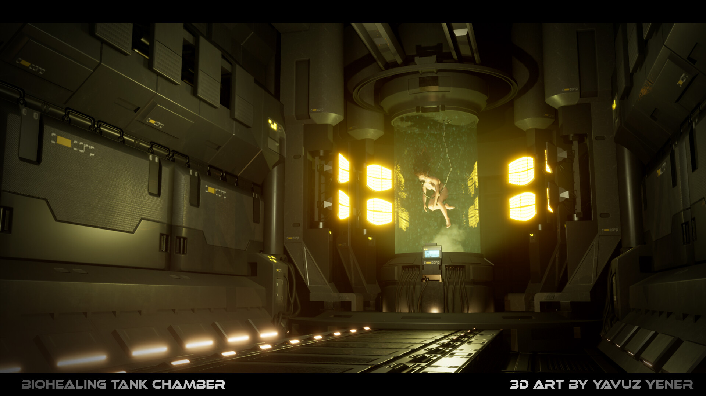
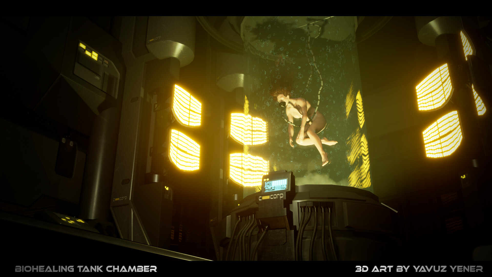
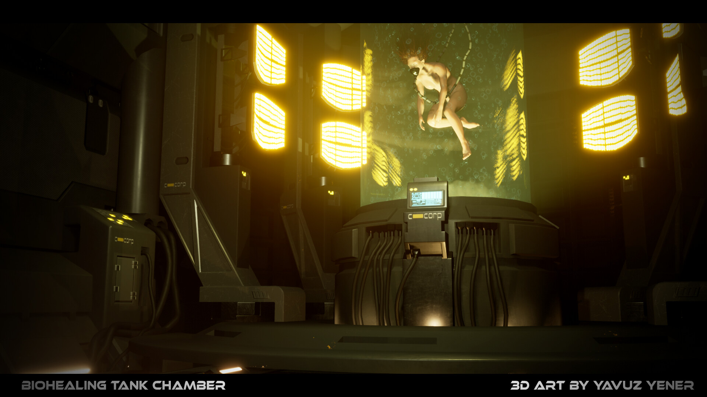
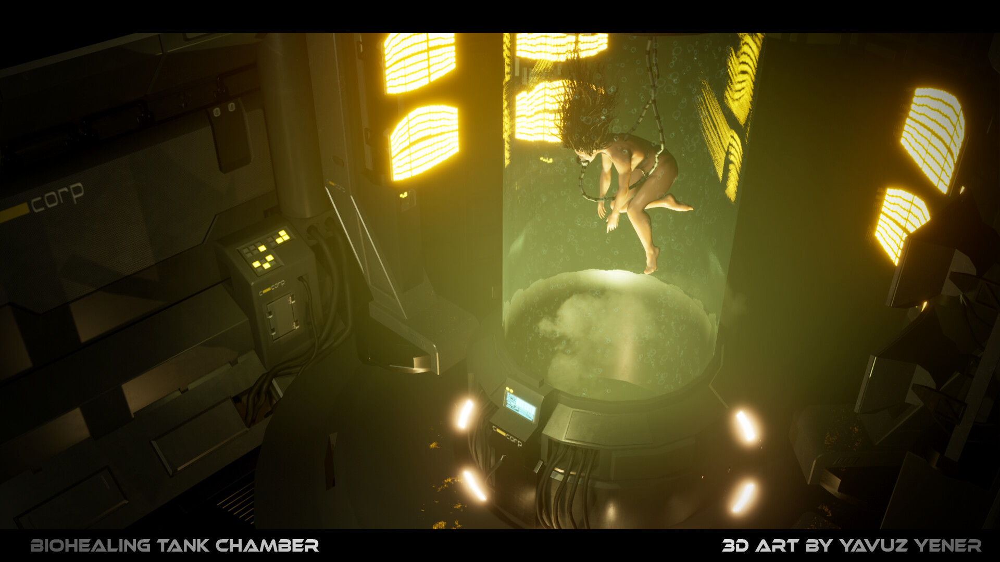
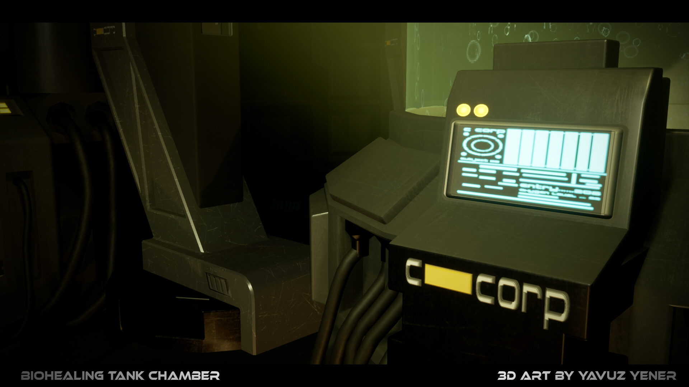
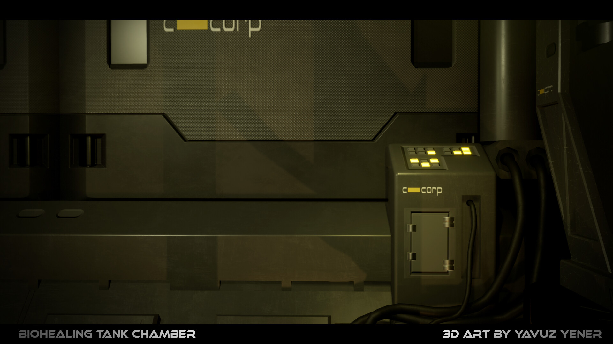
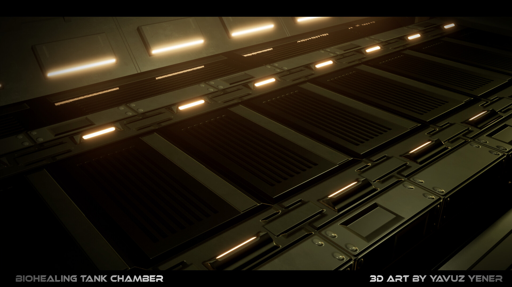
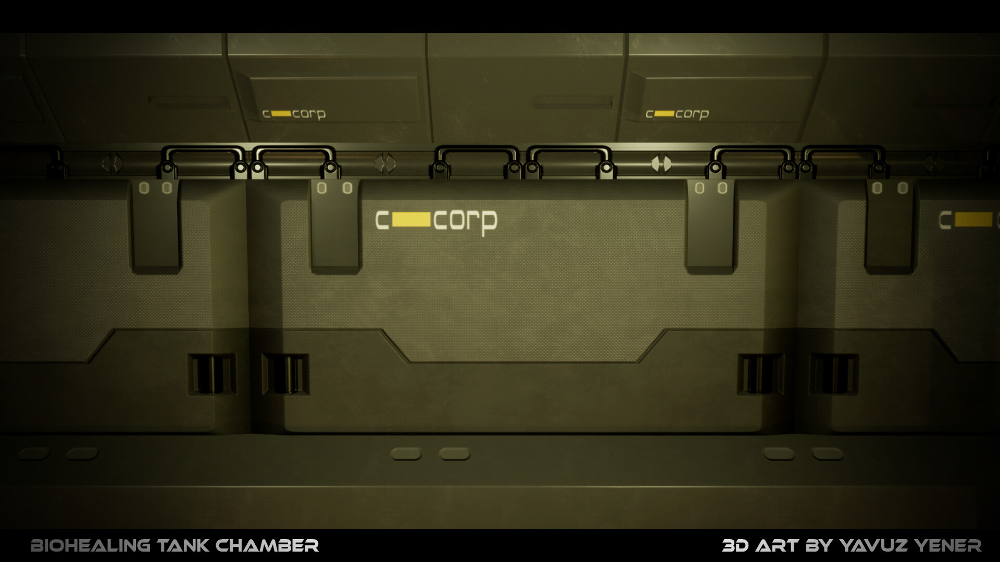
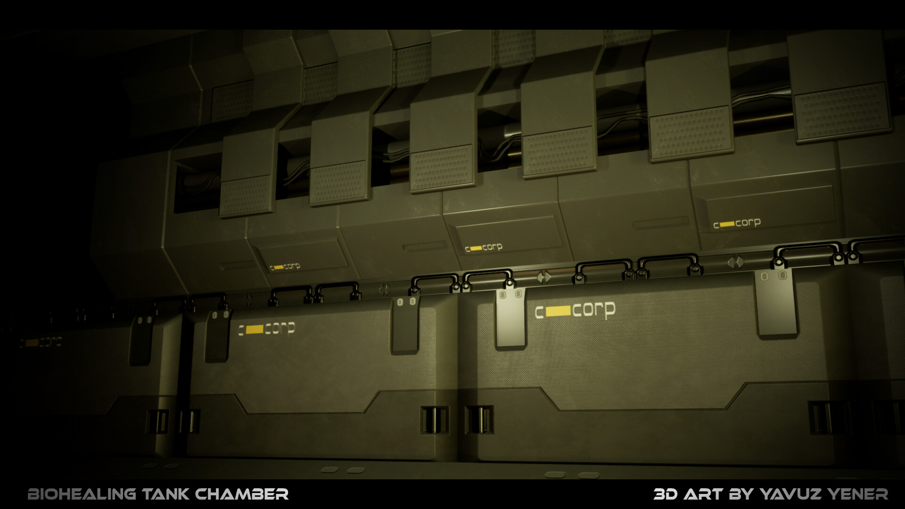
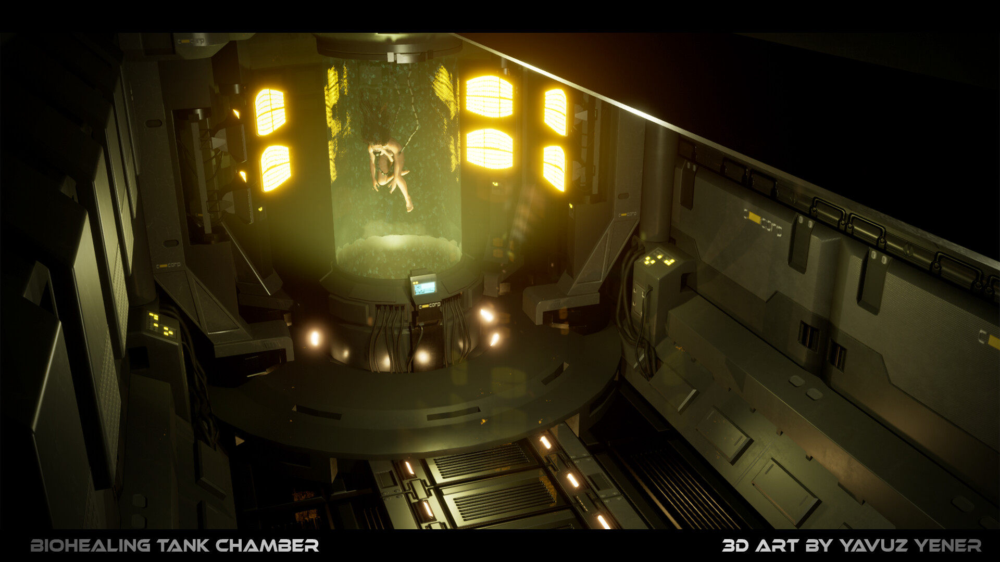

# Healing Tank

ESP32 firmware driving a 128×64 SSD1306 OLED as a cyberpunk biohealing tank terminal display — a prop controller for a sci-fi chamber build.

---

## What it looks like

```
╔══════════════════════╗
║ = BIO-TANK MK.VII =  ║  ← inverted header
║ SUBJ:ONLINE 00:04:23 ║  ← session timer counting up
║ RGN [========░░] 78% ║  ← animated regen progress bar
║ >>CELL REGEN ACTV << ║  ← blinking status, cycles 8 msgs
║ O2:100%  TEMP:36.6C  ║  ← vitals
╚══════════════════════╝
```

- Session timer counts up from boot
- Regen bar fills 0→100% over ~81 seconds, then resets
- Status line cycles through 8 messages with blinking `>>` `<<` brackets
- Runs at 100ms tick loop on FreeRTOS

---

## Hardware

| Part | Details |
|------|---------|
| MCU | ESP32 (any variant with I2C + RMT) |
| Display | SSD1306 OLED 128×64, I2C |
| SDA | GPIO 21 |
| SCL | GPIO 22 |
| I2C address | `0x3C` |
| LED strip | WS2812B, 22 LEDs |
| LED data | GPIO 2 (RMT) |

---

## Wiring

```
                    ESP32 DevKit
                  ┌─────────────┐
            3V3 ──┤ 3V3     VIN ├── 5V (USB)
            GND ──┤ GND     GND ├── GND
                  │             │
          GPIO2 ──┤ IO2         │
         GPIO21 ──┤ IO21        │
         GPIO22 ──┤ IO22        │
                  └─────────────┘

  SSD1306 OLED (I2C, 400 kHz)
  ┌──────────────┐
  │ VCC ─────────┼──── 3V3
  │ GND ─────────┼──── GND
  │ SDA ─────────┼──── GPIO21
  │ SCL ─────────┼──── GPIO22
  └──────────────┘
  Note: most modules have built-in pull-ups.
  If not: 4.7 kΩ from SDA → 3V3 and SCL → 3V3.

  WS2812B Strip (22 LEDs, GRB, RMT)

  5V ───────────────────┬──── VCC (strip)
                      [100–1000 µF]   ← across power rails,
                        │              close to strip
  GND ──────────────────┴──── GND (strip)

  GPIO2 ──[300–470 Ω]──────── DIN (strip)

  Future – pump (MOSFET, parts TBD)
  5V ──── pump ──── MOSFET drain
                    MOSFET source ──── GND
                    MOSFET gate ── 330 Ω ── GPIO (free)
                    1N4007 flyback diode across pump terminals
```

---

## Build & Flash

**Prerequisites**

```bash
# Install Rust ESP toolchain
cargo install espup && espup install

# Install flash/linker tools
cargo install espflash ldproxy

# Add yourself to the serial port group (re-login after)
sudo usermod -aG uucp $USER
```

**Build**

```bash
source ~/export-esp.sh   # sets PATH + LIBCLANG_PATH for xtensa toolchain
cargo build --release
```

**Flash**

```bash
espflash flash target/xtensa-esp32-espidf/release/healing-tank-screen --port /dev/ttyUSB0
```

**Monitor**

```bash
espflash monitor --port /dev/ttyUSB0
```

---

## Configuration

WiFi credentials are not committed. Create `src/config.rs` before building:

```rust
pub const WIFI_SSID: &str = "your-network-name";
pub const WIFI_PASS: &str = "your-password";
```

This file is gitignored.

---

## Stack

- **Rust** with `esp` toolchain (xtensa-esp32-espidf target)
- [`esp-idf-svc`](https://github.com/esp-rs/esp-idf-svc) / [`esp-idf-hal`](https://github.com/esp-rs/esp-idf-hal) — ESP-IDF HAL
- [`ssd1306`](https://github.com/jamwaffles/ssd1306) — display driver
- [`embedded-graphics`](https://github.com/embedded-graphics/embedded-graphics) — 2D drawing primitives

---

## Inspiration

This prop is inspired by the **Biohealing Tank Chamber** 3D art series by **Yavuz Yener** — a dark industrial sci-fi chamber where a subject floats in green healing liquid surrounded by C-Corp machinery and glowing terminals.

[](https://www.youtube.com/watch?v=_1hYA1enYzo)

> *"Biohealing Tank Chamber" — 3D art by Yavuz Yener*  
> Video: [youtube.com/watch?v=_1hYA1enYzo](https://www.youtube.com/watch?v=_1hYA1enYzo)

### Reference images

| | | |
|---|---|---|
|  |  |  |
|  |  |  |
|  |  |  |
|  | | |

All 3D artwork © Yavuz Yener. Used here purely as visual reference for the prop build.
