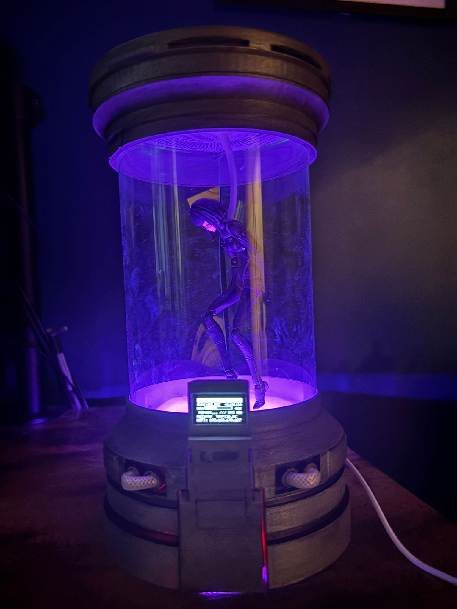
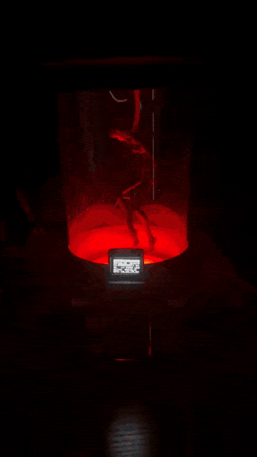
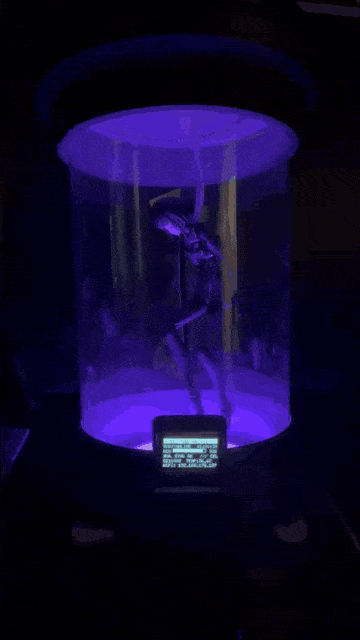
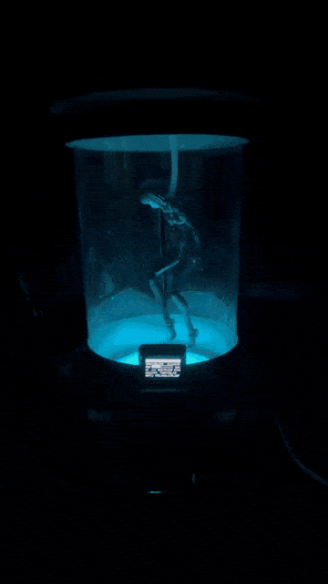
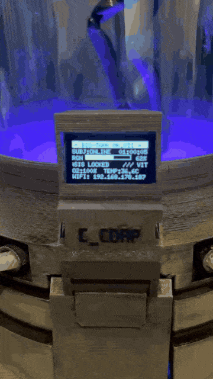
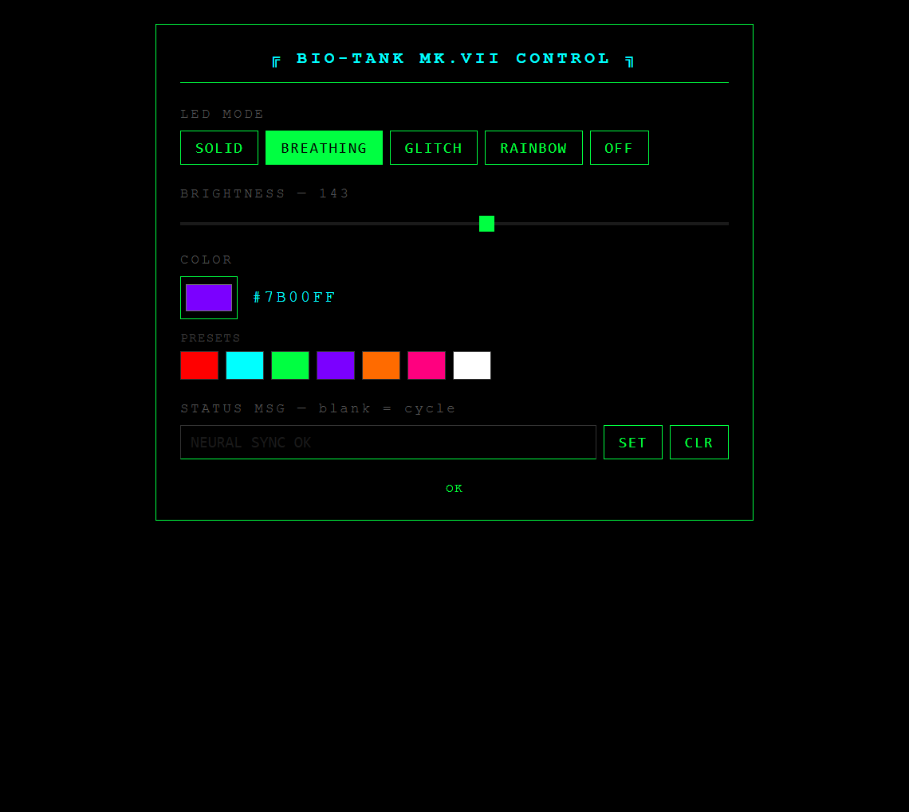
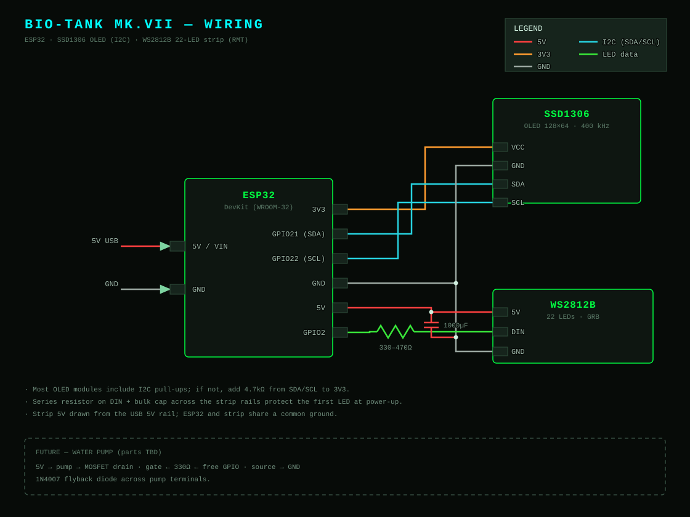
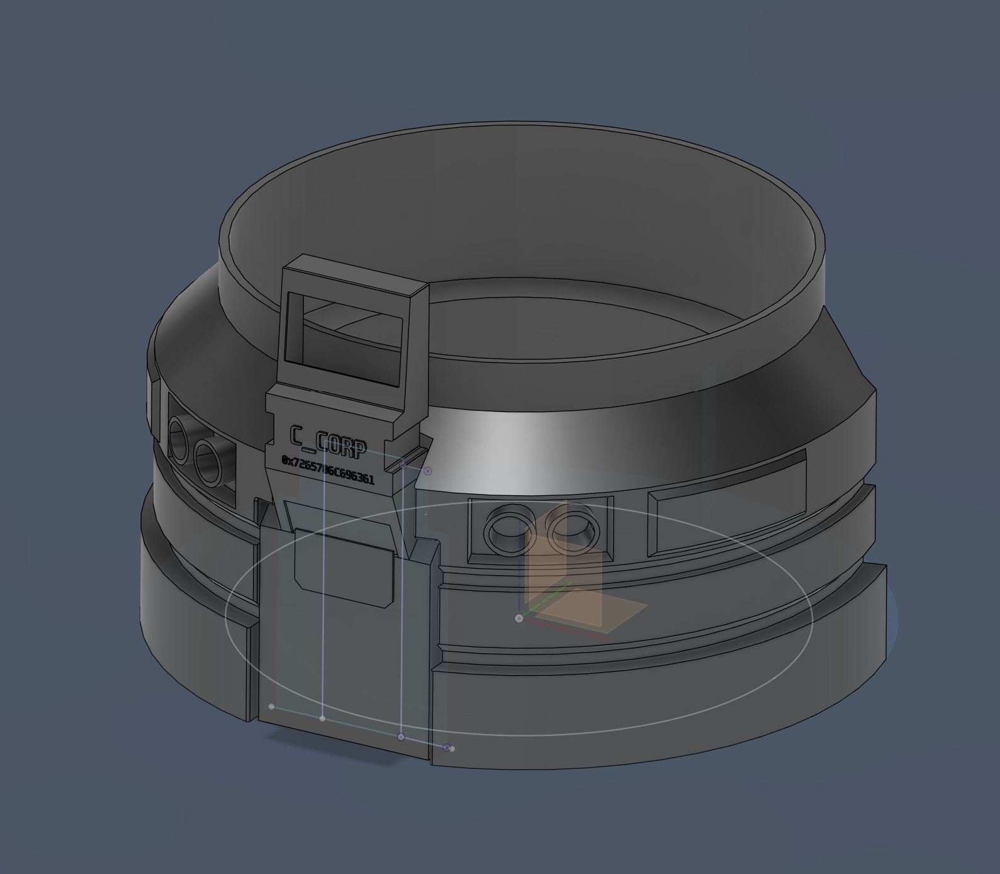
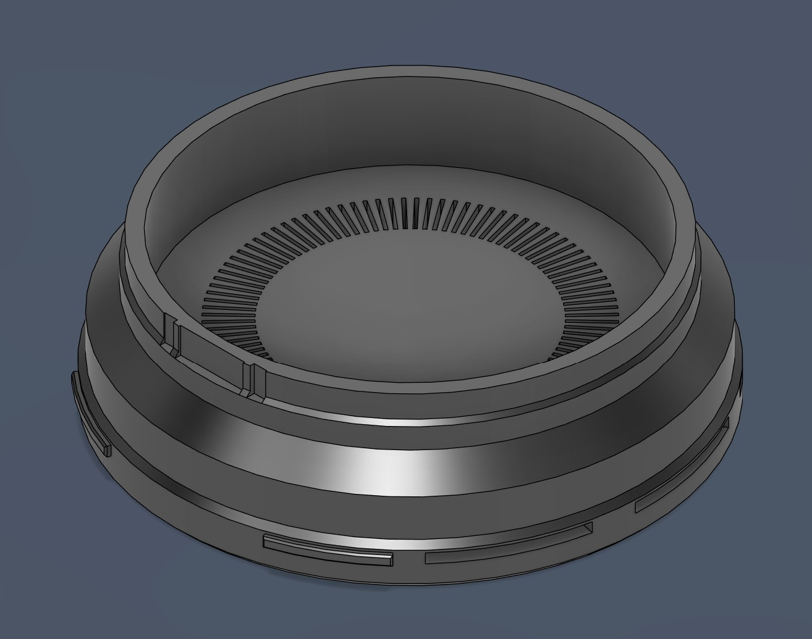

# Healing Tank

ESP32 firmware for a cyberpunk biohealing tank prop. Drives a 128×64 SSD1306 OLED display and a WS2812B LED strip, with a WiFi-hosted web UI for live control.

<p align="center">
  
</p>

<table align="center">
  <tr>
    <td align="center"><br><sub>Breathing · red</sub></td>
    <td align="center"><br><sub>Solid · purple</sub></td>
    <td align="center"><br><sub>Glitch · cyan</sub></td>
    <td align="center"><br><sub>Front panel</sub></td>
  </tr>
</table>

<p align="center"><sub>Full-resolution clips: <a href="media/">media/*.mp4</a></sub></p>

---

## Inspiration

This prop is inspired by the **Biohealing Tank Chamber** 3D art series by **Yavuz Yener** — a dark industrial sci-fi chamber where a subject floats in green healing liquid surrounded by C-Corp machinery and glowing terminals.

[](https://www.youtube.com/watch?v=_1hYA1enYzo)

> *"Biohealing Tank Chamber" — 3D art by Yavuz Yener*  
> Video: [youtube.com/watch?v=_1hYA1enYzo](https://www.youtube.com/watch?v=_1hYA1enYzo)

### Reference images

| | | |
|---|---|---|
|  |  |  |
|  |  |  |
|  |  |  |
|  | | |

All 3D artwork © Yavuz Yener. Used here purely as visual reference for the prop build.

---

## What it looks like

**OLED display (6 rows, 100ms tick loop)**

```
╔════════════════════════╗
║ = BIO-TANK MK.VII =    ║  ← inverted header bar
║ SUBJ:ONLINE  00:04:23  ║  ← subject status + session timer (counts up)
║ RGN [========░░]  78%  ║  ← animated regen bar (0→100%, ~81s cycle)
║ CELL REGEN ACTV ///    ║  ← scrolling marquee, cycles 8 status messages
║ O2:100%  TEMP:36.6C    ║  ← static vitals
║ WIFI: 192.168.1.42     ║  ← WiFi status (connecting / IP / failed)
╚════════════════════════╝
```

Occasional glitch overlay flickers random scanlines and corrupts the ticker row with hex error messages — synced with the LED glitch mode.

**Web UI** — served from the ESP32 at its IP (port 80):



- LED mode buttons: SOLID / BREATHING / GLITCH / RAINBOW / OFF
- Brightness slider (0–255)
- Color picker with 7 cyberpunk presets (red, cyan, green, purple, orange, pink, white)
- Custom OLED status message (overrides scrolling marquee while set)

---

## Hardware

| Part | Details |
|------|---------|
| MCU | ESP32 (WROOM-32 or any variant with I2C + RMT) |
| Display | SSD1306 OLED 128×64, I2C |
| SDA | GPIO 21 |
| SCL | GPIO 22 |
| I2C speed | 400 kHz |
| LED strip | WS2812B, 22 LEDs |
| LED data | GPIO 2 (RMT) |

---

## Wiring



---

## Enclosure

3D-printable parts designed in Fusion 360 live in [`models/`](models/) — see the [models README](models/README.md) for part breakdown and print notes.

<p>
  
  
</p>

---

## Build & Flash

**Prerequisites**

```bash
# Install Rust ESP toolchain
cargo install espup && espup install

# Install flash/linker tools
cargo install espflash ldproxy

# Add yourself to the serial port group (re-login after)
sudo usermod -aG uucp $USER
```

**Makefile targets**

```bash
make build          # cross-compile release binary
make flash          # build + flash to /dev/ttyUSB0
make monitor        # open serial monitor (115200 baud)
make flash-monitor  # flash then immediately monitor
make check          # cargo check (fast type/borrow check)
make clean          # cargo clean

# Override port
make flash PORT=/dev/ttyACM0
```

The Makefile handles sourcing `~/export-esp.sh` and setting `LD_LIBRARY_PATH` for NixOS automatically.

---

## Configuration

WiFi credentials are not committed. Create `src/config.rs` before building:

```rust
pub const WIFI_SSID: &str = "your-network-name";
pub const WIFI_PASS: &str = "your-password";
```

This file is gitignored. The device announces itself as `healing-tank` via DHCP hostname — many routers expose this as `healing-tank.local`.

---

## REST API

All endpoints served on port 80.

| Method | Path | Body | Description |
|--------|------|------|-------------|
| `GET` | `/` | — | Web UI (HTML) |
| `GET` | `/api/state` | — | Full state as JSON |
| `POST` | `/api/mode` | `{"mode":"solid"\|"breathing"\|"glitch"\|"rainbow"\|"off"}` | Set LED mode |
| `POST` | `/api/brightness` | `{"value":0-255}` | Set brightness |
| `POST` | `/api/color` | `{"r":0-255,"g":0-255,"b":0-255}` | Set LED color |
| `POST` | `/api/message` | `{"text":"..."}` | Set OLED status message (empty = resume marquee) |

Example:

```bash
curl -X POST http://192.168.1.42/api/mode -H 'Content-Type: application/json' -d '{"mode":"rainbow"}'
curl -X POST http://192.168.1.42/api/color -H 'Content-Type: application/json' -d '{"r":0,"g":255,"b":65}'
```

---

## Stack

- **Rust** with `esp` toolchain (`xtensa-esp32-espidf` target)
- [`esp-idf-svc`](https://github.com/esp-rs/esp-idf-svc) / [`esp-idf-hal`](https://github.com/esp-rs/esp-idf-hal) — ESP-IDF HAL (WiFi, HTTP server, I2C, RMT)
- [`ssd1306`](https://github.com/jamwaffles/ssd1306) — display driver
- [`embedded-graphics`](https://github.com/embedded-graphics/embedded-graphics) — 2D drawing primitives
- [`serde_json`](https://github.com/serde-rs/json) — JSON for REST API
